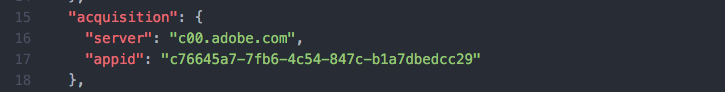
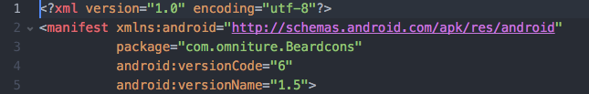

### Introduction
About 6 months ago we released a new version of acquisition tracking within
mobile services and the mobile sdks.   This release added a bunch of awesome
features to the acquisition tracking capabilities of Adobe Mobile Services.

One of those features provides the capability to manually create Acquisition
links without needing to use the Mobile Services UI.  This is extremely helpful
when acquisition links need to be created programmatically, or via some other
automated process.

### Let's get started
This post will assume a working knowledge of Adobe Mobile Services, as well as
access to view application settings within AMS.

###### Anatomy of an acquisition link

An acquisition link contains multiple parts.  The initial portion of the url (up
to the query string start at the question mark) denotes the acquisition server,
and a unique application identifier.  The query string itself provides
additional information, such as the app identifier in the app store(s), as well
as additional context to pass on to the app after it's been installed.  Before
we talk about how to create an acquisition link, let's tear one apart and
get some more detail on each of the parts:

Raw Link:
```html
https://c00.adobe.com/v3/c76645a7-7fb6-4c54-847c-b1a7dbedcc29/start?a_i_id=835196493&a_g_id=com.omniture.Beardcons&a_dd=i&ctxa.referrer.campaign.name=Blog+Campaign&ctxa.referrer.campaign.trackingcode=ib637rrr&ctxblog.topic=acquisition&ctxblog.author=pete
```

That's quite a bit to digest, so let's break it down into individual components:

| HTML Fragment | Explanation |
| ------------- | ----------- |
| https://c00.adobe.com/v3/ | **Root path** for *all* acquisition links |
| c76645a7-7fb6-4c54-847c-b1a7dbedcc29/ | **Tracking identifier** for the application.  This identifier is generated by Mobile Services, and can be found in the Manage App Settings screen, by clicking the _More Details_ link in the _SDK Acquisition Options_ section. Alternatively the **Tracking Identifier** can be found inside the ADBMobileConfig.json file (as acquisition/appid): |
| start | Final piece of the root path, simply denotes that this is the link that starts an acquisition.|
| ?a_i_id=8135196493 | The **a_i_id** parameter is set to the application ID within the iTunes store.  This parameter is required if you want to direct users to the iTunes app store.  You can find this value by copying the itunes URL For your application, and looking for the *id* component in the path, ex: 			itunes.apple.com/cn/app/bea-rd-cons/id**835196493**?l=en&mt=8&uo=4|
| &a_g_id=com.omniture.Beardcons | The **a_g_id** parameter is set to the application ID within the Google Play Store.  This parameter is required if you want to direct users to the Google Play Store.  You can find this value inside the AndroidManifest.xml file for your application, it'll be part of the _manifest_ tag, specifically the _package_ attribute: |
| &a_dd=i | The **a_dd** parameter denotes the default store destination.  It can be set to **i** to default to the iTunes store, or **g** to default to the Google Play store.  This parameter is used to redirect the user to an app store when the user's device type cannot be determined via the incoming request (or if the user is on a non-mobile device).  Note: The chosen value **i** or **g** must have a corresponding **a_?_id** parameter defined.|
| &ctxa.referrer.campaign.name=Blog+Campaign | This is a custom context data parameter.  Context data parameters are defined by the **ctx** prefix.  When this acquisition link is attributed on the client side, the **ctx** prefix will be removed, and the context data key _a.referrer.campaign.name_ will be set to _Blog Campaign_.|
| &ctxa.referrer.campaign.trackingcode=ib637rrr | This is a custom context data parameter (see row above for further explanation).  This context data key, _a.referrer.campaign.trackingcode_ will directly populate the Campaign variable (setting it to _ib637rrr_ in this example) in Analytics (assuming that your application has been configure with the Mobile Application Template within Mobile Services). |
| &ctxblog.topic=acquisition | This is a custom context data key, _blog.topic_ which I'm setting to _acquisition_. |
| &ctxblog.author=pete | This is another custom context data key, _blog.author_, which I'm setting to _pete_. |

###### Creating an acquisition link from scratch

Now that we've walked through the individual pieces of an acquisition link,
let's create a new one from scratch.  Here's the individual components for our
new acquisition link:

| Component | Value |
| --------- | ----- |
| Tracking Identifier | c76645a7-7fb6-4c54-847c-b1a7dbedcc29 |
| iOS App Store ID    | 8135196493 |
| Google Play App Store ID | com.omniture.Beardcons |
| Default App Store | Google Play |
| Campaign Code | testblogcampaign |
| Context Data | my.company = adobe, my.name = pete |

Now we just build a url using our components (note: It):

```html
https://c00.adobe.com/v3/c76645a7-7fb6-4c54-847c-b1a7dbedcc29/start?a_i_id=8135196493&a_g_id=com.omniture.Beardcons&a_dd=g&ctxa.referrer.campaign.trackingcode=testblogcampaign&ctxmy.company=adobe&ctxmy.name=pete
```

### Closing

Congratulations, you're now ready to create acquisition links on the fly to
help drive app installations!  Also be sure to check out the new Marketing Links
functionality in [Adobe Mobile Services](https://mobilemarketing.adobe.com) if
you need more advanced functionality (like conditional redirects, and deeplink
support.)
