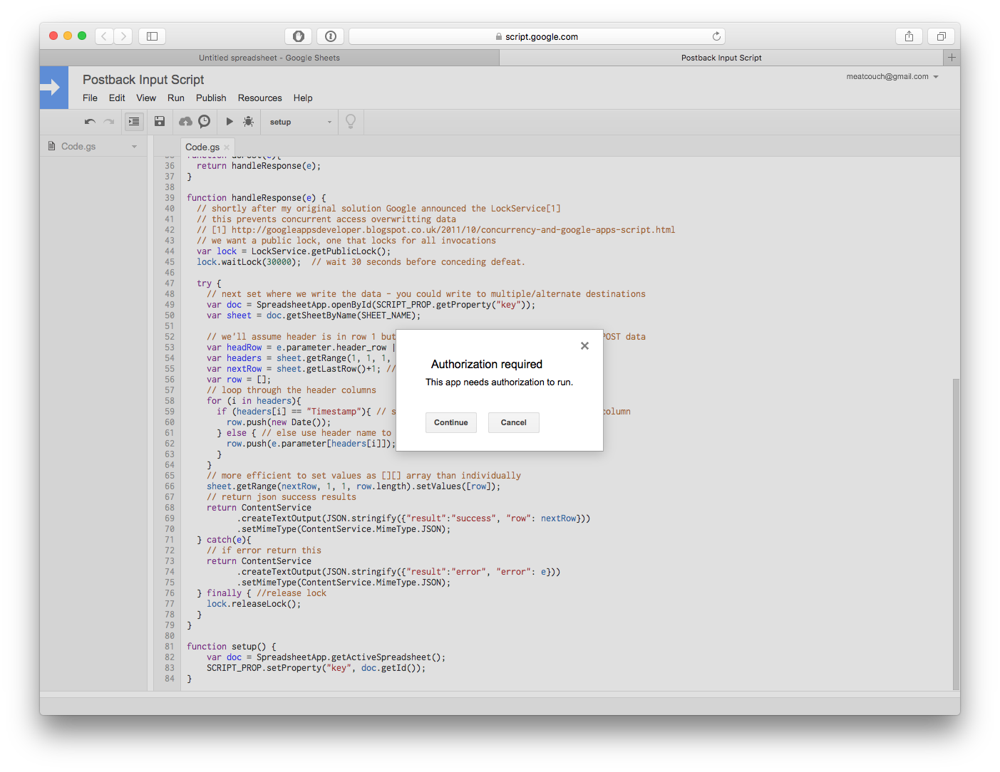

**Introduction**

In September of last year, we release a new version of the Mobile Services SDK
(v4.6).  This release included a new _Postbacks_ feature, which allows the
implementation of client-side GET/POST requests to 3rd-party systems triggered
by the Adobe Analytics implementation in a Mobile App.  Postbacks can be used to
implement all kinds of cool data integrations, but they can also be used for
debugging and "peeking" at live data.

In this tutorial, we'll look at how easy it is to implement a postback directly
into a Google Spreadsheet document for troubleshooting purposes.

**Pre-requisites**

* Mobile application (iOS or Android) with at least a basic Lifecycle Metrics
implementation of the Adobe Mobile Services SDK.
* Access to Adobe Mobile Services with _Mobile App Admin_ privileges.
* Access to Google Spreadsheets

**Implementation**

For this implementation we're going to use a Google Spreadsheet as a repository
to ingest a subset of data being collected by the Mobile Services SDK.  It's
worth noting that this method should be used for troubleshooting / small scale
development.  If you're attempting to create a postback for a large number of
users you may (very quickly) run into limits with Google Spreadsheets.

**Step 1 - Create a Google Sheets document to receive the data**

**Step 2 - Add the magic script**

Once you've created a new Sheet, you'll need to add some logic to enable the
document to receive data programmatically.

First, open the Script Editor by navigating to the Tools|Script Editor menu.

Now we need to retrieve the magic script(All credit to
	[Martin Hawksey](https://github.com/mhawksey)). Open a new browser window / tab and navigate to https://gist.github.com/mhawksey/1276293
, copy the entirety of the script and paste it into the Script Editor for your
Sheet (note: replace everything in the editor, with the new script).

Now save the script(File|Save or by clicking the Save icon), feel free to name
the project however you like:

**Step 3 - Initialize the script and turn it into a web application**

You now need to initialize the script by running it's _setup_ function.  This is
achieved by using the function drop-down in the script editor to select the
_setup_ function, and then clicking the play button:

After you click the play button, the script will need you to grant permissions
before it can continue:

After clicking the continue button you will see more detail about the required
permissions.  Click the Allow button.

After you've granted the required permissions to the script, the last step is
to turn the script into a web application.  Use the Publish|Deploy as web app
menu item to create your web application:

Lastly, grant the appropriate permissions to the web app.  Specifically you will
need to change the _Who has access to the app_ drop down to be "Anyone, even
anonymous".  This will allow the postbacks from the app to insert data using the
script without needing to authenticate with Google credentials:

After clicking the Deploy button, you should see a confirmation similar to this:

Copy the _Current web app URL_, and paste it somewhere where you can get it back
(or leave the script tab open), we'll need this URL later.

**Step 4 - Add some columns for data**

The last step we need to perform on the spreadsheet is to add some column names
so the script knows where to put the incoming data.  The column names will be
added in the first row of the spreadsheet.  These names must match the incoming
data exactly (they're case sensitive), so it'll be easier to have simple names
without spaces.

The script you created in step #2 will also automatically add a timestamp for
the row if you name the column _Timestamp_.

We'll add two columns, one for appid and one for device:

**Step 5 - Add a postback to your app to start sending data**

Congrats, you're almost done!  

The last step is to create a Postback to start sending data into the spreadsheet
you created.  First, login to [Adobe Mobile Services](https://mobilemarketing.adobe.com),
 select your application and then navigate to _Manage App Settings|Manage
Postbacks_ and click the _Create Postback_ button.

Name your postback whatever you like, and put the URL we saved at the end of
Step #3 into the URL box for the postback.  Then click the _Add Post Body_ button
and put the following in the _Post Body_ field:

		appid={a.appid}&device={a.devicename}

Keep in mind that the variable names (_appid_ and _device_) match the column
names that we added to the Spreadsheet in step #4.

Next, update the _Content Type_ to be:

    application/x-www-form-urlencoded

At this point our postback is configured, and we'll leave the default trigger
enabled (which will cause the postback on the first hit of a new session).

Click _Save & Activate_ to enable the postback.

**Done**

We're all done.  Wait a minute or two for the postback to activate, and then
launch your app and keep an eye on the spreadsheet, you should start seeing data
show up immediately.

If you'd like to learn more about Postbacks and their potential usages, check out
the documentation found [here](https://marketing.adobe.com/resources/help/en_US/mobile/ios/postback.html).
